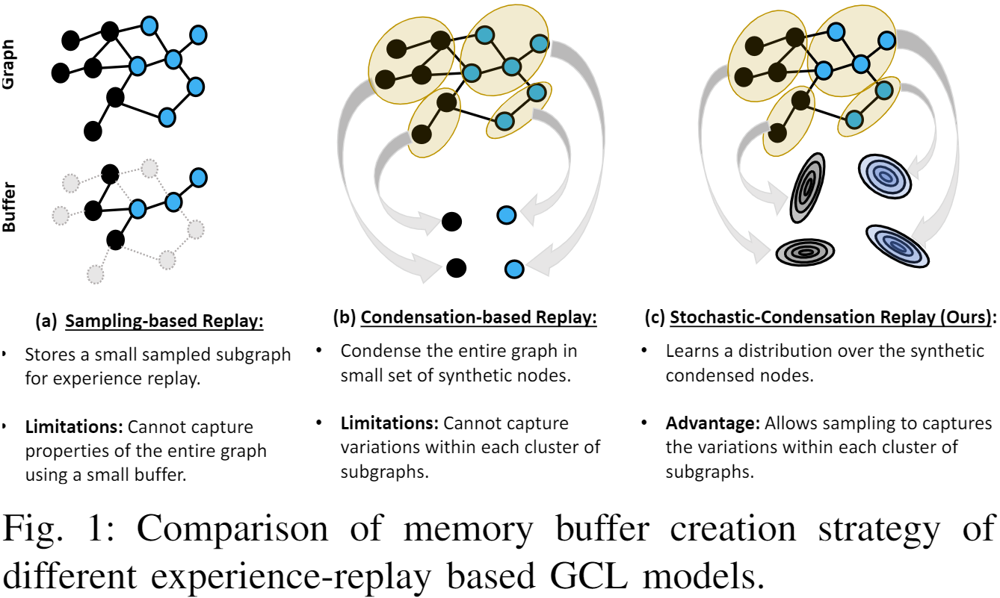
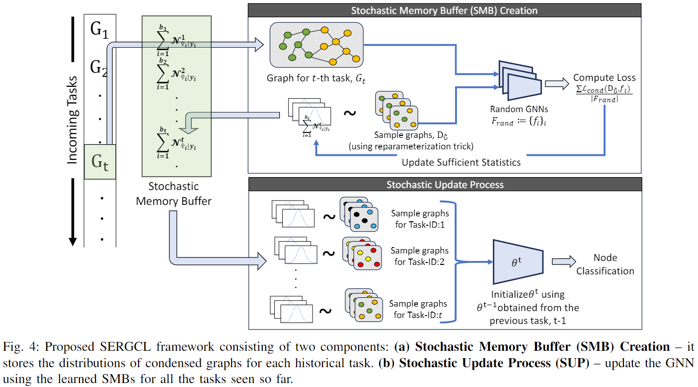
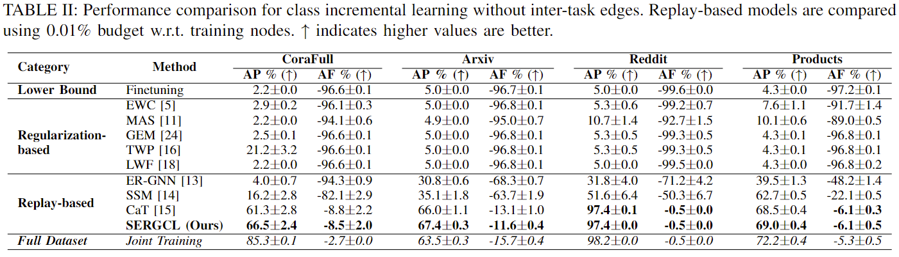
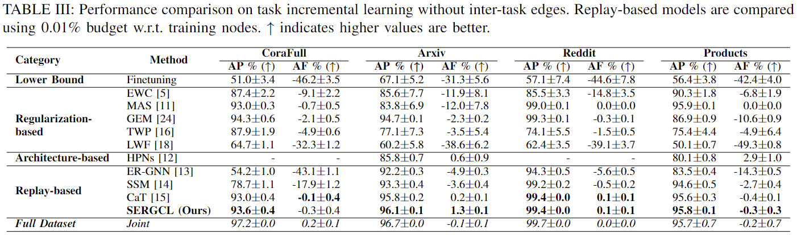
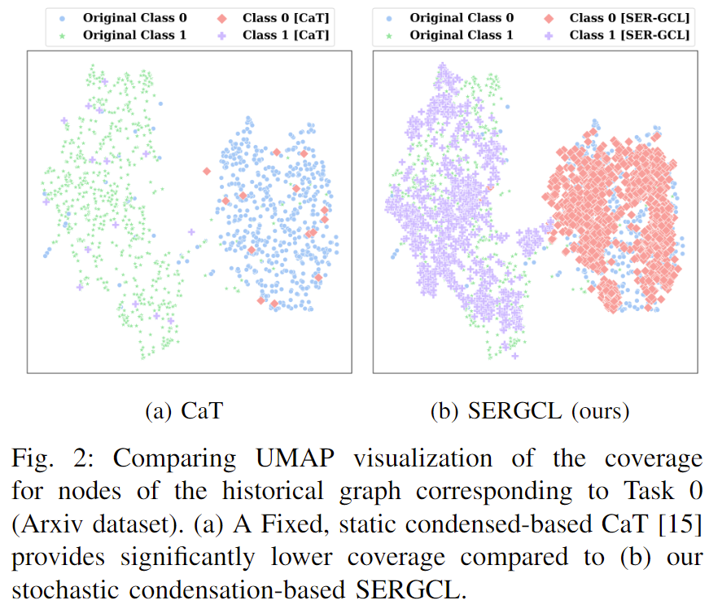

# SERGCL (Stochastic Experience-Replay for Graph Continual Learning)
This is the code for the paper [Stochastic Experience-Replay for Graph Continual
Learning](#).

The following figure compares the typical sampling-based replay for GCL, condensation-based replay for GCL, and  stochastic condensation-based replay (proposed method) for GCL.

The following figure presents an illustration of SERGCL.

# Main experiment results.

# Experiment environment
Our experiments are run on the enviroment based on `Python 3.11.5` the rest of the packages used to conduct the experiments can be found in [requirements.yml](./requirements.yml)

# Usage
To reproduce the results of Table II (classIL setting) and Table III (taskIL setting), please execute [run.sh](./run.sh).

# Credit
This repository was developed based on the following two repositories: [CaT-CGL](https://github.com/superallen13/CaT-CGL) and [CGLB](https://github.com/QueuQ/CGLB).
